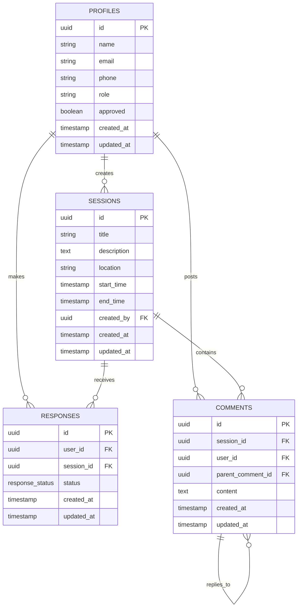

# Data Model: Badminton Squad - Availability & Comments Baseline

**Purpose**: Define database schema and relationships for availability tracking and comments system
**Created**: 2025-12-22
**Feature**: [spec.md](../spec.md) | [plan.md](../plan.md)

## Entity Relationships



## Database Schema

### 1. Profiles Table (extends auth.users)

```sql
CREATE TABLE profiles (
  id UUID PRIMARY KEY REFERENCES auth.users(id) ON DELETE CASCADE,
  name VARCHAR(100) NOT NULL,
  email VARCHAR(255) UNIQUE NOT NULL,
  phone VARCHAR(20),
  role user_role DEFAULT 'normal_user',
  approved BOOLEAN DEFAULT FALSE,
  created_at TIMESTAMP WITH TIME ZONE DEFAULT TIMEZONE('utc', NOW()),
  updated_at TIMESTAMP WITH TIME ZONE DEFAULT TIMEZONE('utc', NOW()),

  CONSTRAINT profiles_contact_check CHECK (
    email IS NOT NULL OR phone IS NOT NULL
  ),
  CONSTRAINT profiles_name_length CHECK (LENGTH(name) >= 2)
);

CREATE TYPE user_role AS ENUM ('normal_user', 'super_admin', 'cred_manager');
```

### 2. Sessions Table

```sql
CREATE TABLE sessions (
  id UUID PRIMARY KEY DEFAULT uuid_generate_v4(),
  title VARCHAR(200),
  description TEXT,
  location VARCHAR(255) NOT NULL,
  start_time TIMESTAMP WITH TIME ZONE NOT NULL,
  end_time TIMESTAMP WITH TIME ZONE NOT NULL,
  created_by UUID NOT NULL REFERENCES profiles(id) ON DELETE CASCADE,
  created_at TIMESTAMP WITH TIME ZONE DEFAULT TIMEZONE('utc', NOW()),
  updated_at TIMESTAMP WITH TIME ZONE DEFAULT TIMEZONE('utc', NOW()),

  CONSTRAINT sessions_time_check CHECK (end_time > start_time),
  CONSTRAINT sessions_future_check CHECK (start_time > NOW()),
  CONSTRAINT sessions_same_day_check CHECK (
    DATE(start_time AT TIME ZONE 'Asia/Kolkata') =
    DATE(end_time AT TIME ZONE 'Asia/Kolkata')
  ),
  CONSTRAINT sessions_title_length CHECK (
    title IS NULL OR LENGTH(title) <= 200
  )
);
```

### 3. Responses Table

```sql
CREATE TYPE response_status AS ENUM ('COMING', 'NOT_COMING', 'TENTATIVE');

CREATE TABLE responses (
  id UUID PRIMARY KEY DEFAULT uuid_generate_v4(),
  user_id UUID NOT NULL REFERENCES profiles(id) ON DELETE CASCADE,
  session_id UUID NOT NULL REFERENCES sessions(id) ON DELETE CASCADE,
  status response_status NOT NULL,
  created_at TIMESTAMP WITH TIME ZONE DEFAULT TIMEZONE('utc', NOW()),
  updated_at TIMESTAMP WITH TIME ZONE DEFAULT TIMEZONE('utc', NOW()),

  UNIQUE(user_id, session_id)
);
```

### 4. Comments Table

```sql
CREATE TABLE comments (
  id UUID PRIMARY KEY DEFAULT uuid_generate_v4(),
  session_id UUID NOT NULL REFERENCES sessions(id) ON DELETE CASCADE,
  user_id UUID NOT NULL REFERENCES profiles(id) ON DELETE CASCADE,
  parent_comment_id UUID REFERENCES comments(id) ON DELETE CASCADE,
  content TEXT NOT NULL,
  created_at TIMESTAMP WITH TIME ZONE DEFAULT TIMEZONE('utc', NOW()),
  updated_at TIMESTAMP WITH TIME ZONE DEFAULT TIMEZONE('utc', NOW()),

  CONSTRAINT comments_content_check CHECK (LENGTH(TRIM(content)) > 0),
  CONSTRAINT comments_no_self_parent CHECK (id != parent_comment_id)
);
```

### 5. Analytics Table

```sql
CREATE TABLE user_analytics (
  id UUID PRIMARY KEY DEFAULT uuid_generate_v4(),
  user_id UUID NOT NULL REFERENCES profiles(id) ON DELETE CASCADE,
  session_id UUID NOT NULL REFERENCES sessions(id) ON DELETE CASCADE,
  predicted_status response_status NOT NULL,
  actual_attendance BOOLEAN,
  recorded_at TIMESTAMP WITH TIME ZONE DEFAULT TIMEZONE('utc', NOW())
);
```

## Business Rules Implementation

### 1. Response Management

- One active response per user per session (enforced by unique constraint)
- Response changes allowed until T-1 day midnight
- Courts calculation: `CEIL(COUNT(status = 'COMING') / 4.0)`

### 2. Session Access Control

- Only creators can edit/delete their sessions
- No edits allowed on session day (enforced by constraint + application logic)
- All logged-in users can view all sessions

### 3. Comment Threading

- Unlimited nesting depth supported
- Parent-child relationship maintained via foreign key
- Chronological ordering within thread levels

### 4. Role-based Permissions

- `normal_user`: Create sessions, respond, comment
- `super_admin`: All permissions + user approval management
- `cred_manager`: Future scope for court booking credentials

## Indexes and Performance

```sql
-- Response queries optimization
CREATE INDEX responses_session_status_idx ON responses(session_id, status);
CREATE INDEX responses_user_session_idx ON responses(user_id, session_id);

-- Session queries optimization
CREATE INDEX sessions_start_time_idx ON sessions(start_time);
CREATE INDEX sessions_created_by_idx ON sessions(created_by);

-- Comment threading optimization
CREATE INDEX comments_session_parent_idx ON comments(session_id, parent_comment_id);
CREATE INDEX comments_session_created_idx ON comments(session_id, created_at);

-- Profile queries optimization
CREATE INDEX profiles_role_approved_idx ON profiles(role, approved);
```

## Row Level Security Policies

```sql
-- Profiles: Users can view approved profiles, update own profile
ALTER TABLE profiles ENABLE ROW LEVEL SECURITY;

CREATE POLICY "Approved profiles viewable by authenticated users"
  ON profiles FOR SELECT
  TO authenticated
  USING (approved = true);

CREATE POLICY "Users can update own profile"
  ON profiles FOR UPDATE
  TO authenticated
  USING (auth.uid() = id);

-- Sessions: All approved users can view, only creators can modify
ALTER TABLE sessions ENABLE ROW LEVEL SECURITY;

CREATE POLICY "Sessions viewable by approved users"
  ON sessions FOR SELECT
  TO authenticated
  USING (
    EXISTS (
      SELECT 1 FROM profiles
      WHERE id = auth.uid() AND approved = true
    )
  );

CREATE POLICY "Users can create sessions"
  ON sessions FOR INSERT
  TO authenticated
  WITH CHECK (
    auth.uid() = created_by AND
    EXISTS (
      SELECT 1 FROM profiles
      WHERE id = auth.uid() AND approved = true
    )
  );

CREATE POLICY "Creators can update own sessions"
  ON sessions FOR UPDATE
  TO authenticated
  USING (auth.uid() = created_by)
  WITH CHECK (auth.uid() = created_by);

CREATE POLICY "Creators can delete own sessions"
  ON sessions FOR DELETE
  TO authenticated
  USING (auth.uid() = created_by);

-- Responses: Users can manage their own responses
ALTER TABLE responses ENABLE ROW LEVEL SECURITY;

CREATE POLICY "Users can view all responses"
  ON responses FOR SELECT
  TO authenticated
  USING (
    EXISTS (
      SELECT 1 FROM profiles
      WHERE id = auth.uid() AND approved = true
    )
  );

CREATE POLICY "Users can manage own responses"
  ON responses FOR ALL
  TO authenticated
  USING (auth.uid() = user_id)
  WITH CHECK (auth.uid() = user_id);

-- Comments: Users can view all comments, manage own comments
ALTER TABLE comments ENABLE ROW LEVEL SECURITY;

CREATE POLICY "Comments viewable by approved users"
  ON comments FOR SELECT
  TO authenticated
  USING (
    EXISTS (
      SELECT 1 FROM profiles
      WHERE id = auth.uid() AND approved = true
    )
  );

CREATE POLICY "Users can create comments"
  ON comments FOR INSERT
  TO authenticated
  WITH CHECK (
    auth.uid() = user_id AND
    EXISTS (
      SELECT 1 FROM profiles
      WHERE id = auth.uid() AND approved = true
    )
  );

CREATE POLICY "Users can update own comments"
  ON comments FOR UPDATE
  TO authenticated
  USING (auth.uid() = user_id)
  WITH CHECK (auth.uid() = user_id);

CREATE POLICY "Users can delete own comments OR session creators can moderate"
  ON comments FOR DELETE
  TO authenticated
  USING (
    auth.uid() = user_id OR
    EXISTS (
      SELECT 1 FROM sessions
      WHERE id = session_id AND created_by = auth.uid()
    )
  );
```

## Data Validation Rules

### Application-Level Validations

- Session timing: Must be in future, same-day only, logical start/end times
- Response cutoff: Block changes after T-1 day midnight IST
- Location: Required, non-empty string
- Comments: Non-empty content after trimming whitespace
- Role transitions: Only super_admin can change user roles

### Database Constraints

- Foreign key relationships maintain referential integrity
- Unique constraints prevent duplicate responses per user/session
- Check constraints enforce business rules at data layer
- Enum types ensure valid status values

This data model supports all functional requirements while maintaining data integrity and enabling efficient queries for the availability tracking and comments system.
